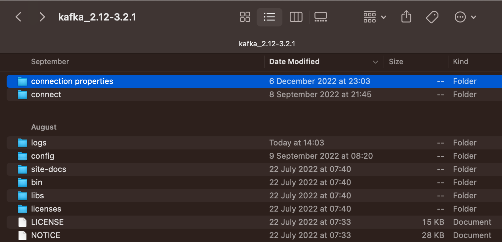
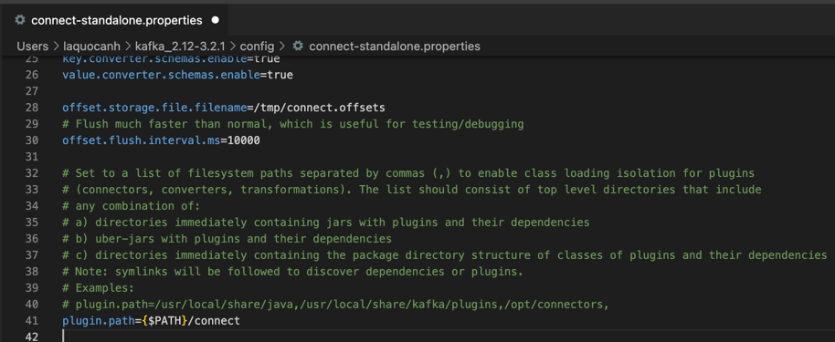
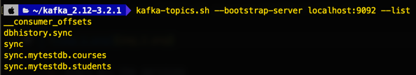
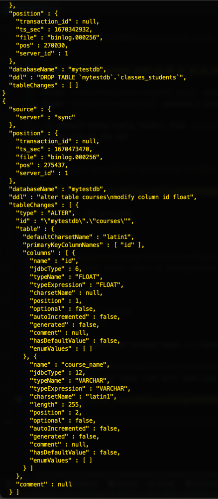
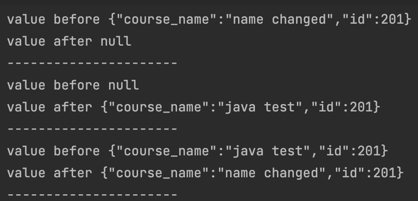
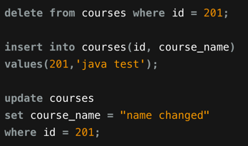

SIMPLE MySQL Change Data Capture with Apache Kafka

I'm still working on sink connector with Elasticsearch to synchronize data but things just not working yet !!!

`Requirements:`

Kafka 2.12-3.2.1:
https://archive.apache.org/dist/kafka/3.2.1/kafka_2.12-3.2.1.tgz
    

Debezium MySQL source connector:
https://www.confluent.io/hub/debezium/debezium-connector-mysql

MySQL version 8.0.26

Elasticsearch 7.5.2:

https://www.elastic.co/downloads/past-releases/elasticsearch-7-5-2

Kibana 7.5.2:

https://www.elastic.co/downloads/past-releases/kibana-7-5-2

Elasticsearch Sink Connector:
https://www.confluent.io/hub/confluentinc/kafka-connect-elasticsearch

`Step`

1. Place the `connect/debezium-connector-mysql` and `connection properties` to Apache Kafka folder like this

   
    
- folder `connect/debezium-connector-mysql` place all the jar file of MySQL source connector and Elasticsearch sink connector.
- folder `connection properties` contains 2 property file to connect from Kafka to MySQL and Elasticsearch. `YOU NEED TO CHANGE THE CONFIG TO YOURS SERVER SETTING`

2. In default Kafka config folder, file `connect-standalone.properties`
add this line to the end
   

        plugin.path=${PATH TO /connect FOLDER AT STEP 1}

   

3. Start all the services
 
    Kafka

        bin/zookeeper-server-start.sh config/zookeeper.properties
        bin/kafka-server-start.sh config/server.properties
    
    Elasticsearch

        bin/elasticsearch
        bin/kibana 

    Start the connection between MySQL <-> Kafka <-> Elasticsearch
            
        bin/connect-standalone.sh config/connect-standalone.properties connection-properties/elasticsearch-connect.properties connection-properties/mysql-connect.properties
4. If everything work topic list will look like this
   
   

5. Topic dbhistory.sync capture all the changes to all the tables

   

6. Topic sync.mytestdb.courses capture all the value changes to `courses` table. 
   - This is the value of message from kafka topic when I run 3 bellow SQL command. 
   - I use java code in the `kafka-connector` project to parse from json. 

      

      

7. You can go to `localhost:5601` to view Elasticsearch document corresponding to Kafka topic name.
   - All the Insert operator work perfect and can be synchronized between MySQL and Elasticsearch
   - But somehow SQL Update and Delete is currently not working. I'm trying to figure this problem.